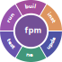
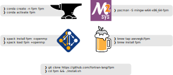
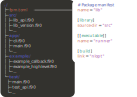
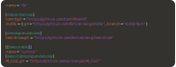

# Fortran package manager ([fpm]) resources

This repository contains resources and artwork created in the context of the Fortran package manager ([fpm]), made available in the public domain (Unlicense).
It is highly appreciated if you credit this work if you reuse it for whatever purpose, but not required.

[fpm]: https://github.com/fortran-lang/fpm

## Command line interface feature overview

## Bootstrapping workflow

## Get fpm now

Note: the conda-forge logo, the MSYS2 logo, the spack logo and the homebrew logo belong to their respective copyright holders.

## Project layout

## Dependency specification in manifest

